# Bildkatalog – 240 kleine Studien

## Tafel 01 · Figur und Bewegung

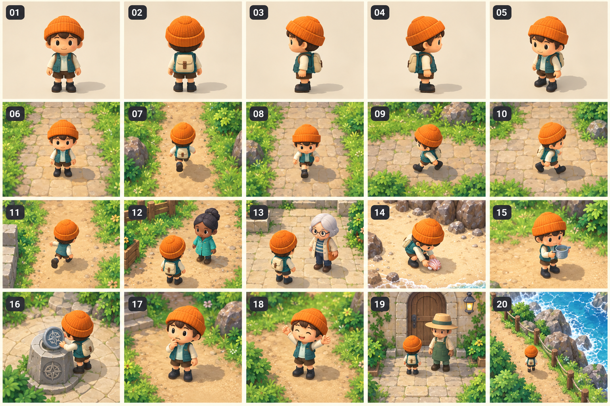

- 01.01: Frontansicht der Spielfigur: ockerfarbene Strickmütze, cremefarbenes Hemd, petrolfarbene Weste, braune Hose, kleiner Rucksack
- 01.02: Rückansicht mit klarer Rucksacksilhouette
- 01.03: Linke Seitenansicht mit flachen dunklen Stiefeln
- 01.04: Rechte Seitenansicht und sichtbarer Hand
- 01.05: Dreiviertelansicht aus der festen Spielkamera
- 01.06: Neutrale Standpose ohne permanentes Wippen
- 01.07: Schritt nach Norden, sichtbarer Gewichtswechsel
- 01.08: Schritt nach Süden, Blick in Laufrichtung
- 01.09: Schritt nach Westen, Hände frei
- 01.10: Schritt nach Osten, keine seitliche Rutschpose
- 01.11: Schritt diagonal mit normalisierter Geschwindigkeit
- 01.12: Sanftes Abbremsen vor einem NPC
- 01.13: Blick zum nächsten Gesprächspartner
- 01.14: Kurzes Aufheben einer Muschel
- 01.15: Tragen einer kleinen Messschale
- 01.16: Einsetzen einer Symbolscheibe in einen Sockel
- 01.17: Nachdenklicher Gesichtsausdruck
- 01.18: Freundliche Freude nach einer Lösung
- 01.19: Gemeinsamer Größenvergleich mit NPC und Tür
- 01.20: Figur im echten Weltmaßstab auf einem Küstenweg

## Tafel 02 · Bewohner und Begegnungen

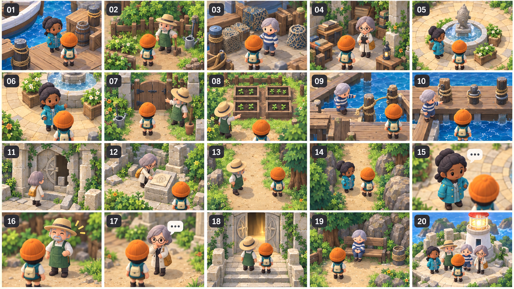

- 02.01: Hafenmeisterin Mara: dunkle Haut, türkisfarbene Regenjacke, keine Uniformkopie
- 02.02: Gärtner Jona: ältere Person, strohfarbener Hut, grüne Schürze
- 02.03: Fischerin Tilda: gestreifter Pullover, kurzer grauer Haarschnitt
- 02.04: Archivarin Elin: Brille, cremefarbener Mantel, ockerfarbene Tasche
- 02.05: Mara am Brunnen vor dem ersten Gespräch
- 02.06: Mara dreht sich zur Spielfigur
- 02.07: Jona vor einer verschlossenen Gartenpforte
- 02.08: Jona zeigt auf vier gleiche Samenkästen
- 02.09: Tilda an einem abgerissenen Stegseil
- 02.10: Tilda zeigt drei Seilbefestigungen
- 02.11: Elin vor einer unvollständigen Ruinentür
- 02.12: Elin legt einen gezeichneten Fund auf den Sockel
- 02.13: Gesprächsabstand zwischen zwei Figuren
- 02.14: Gespräch zweier Figuren auf einem schmalen Weg ohne Blockade
- 02.15: NPC mit kleinem Gesprächssymbol aus Nähe
- 02.16: NPC nach erledigtem Auftrag ohne wiederholtes Fragezeichen
- 02.17: Neutrales Nachfragen nach einem falschen Versuch
- 02.18: Kurze gemeinsame Blickbewegung zur geöffneten Tür
- 02.19: Ruhige Nebenfigur an einer Bank ohne Pflichtaufgabe
- 02.20: Gruppenbild am wieder leuchtenden Küstenfeuer

## Tafel 03 · Zwanzig Baumformen

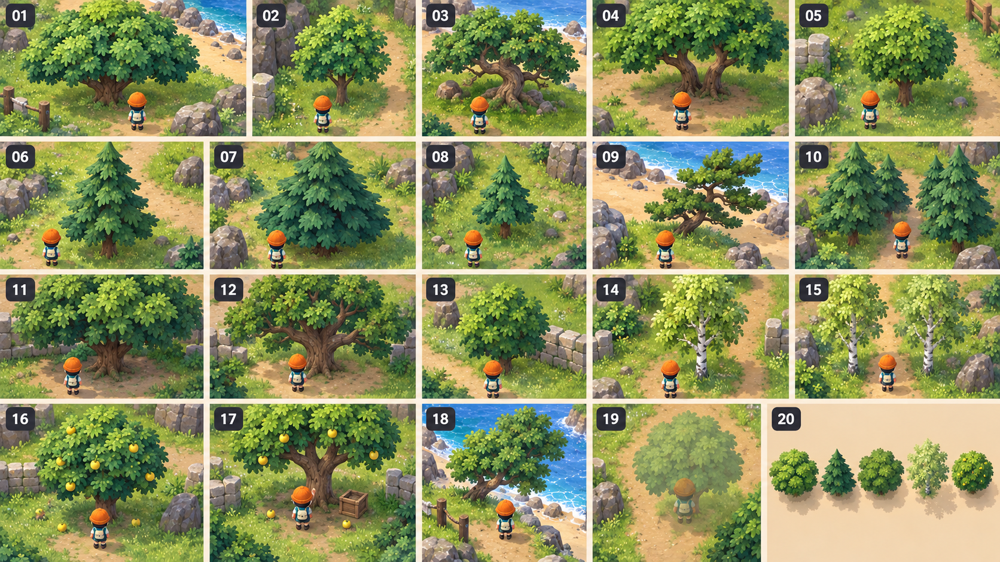

- 03.01: Breite runde Küstenlaube mit vielen überlappenden Blattbüscheln
- 03.02: Schmalere junge Küstenlaube
- 03.03: Alte Laube mit sichtbarem krummen Stamm
- 03.04: Zwillingsstämmige Laube mit freier Bodenfläche
- 03.05: Kleine Kugelkrone aus echten Blattvolumen, kein einzelner Ball
- 03.06: Hohe dreistufige Tanne mit unregelmäßigen Zweigen
- 03.07: Breite Tanne mit dunklem Kronenkern
- 03.08: Junge Tanne mit kurzen Ästen
- 03.09: Windgeformte Tanne nahe Strand
- 03.10: Tannengruppe mit lesbarer Lücke für Weg
- 03.11: Schattige Eiche mit breiter niedriger Krone
- 03.12: Eiche mit ausgeprägten Hauptästen
- 03.13: Kleine Eiche für Randbepflanzung
- 03.14: Helle Birke mit weißen Stammflecken
- 03.15: Birkenpaar am Wegrand
- 03.16: Rundlicher Obstbaum mit wenigen gelben Früchten
- 03.17: Obstbaum mit freiem Greifbereich am Stamm
- 03.18: Küstenbaum mit leicht einseitiger Krone
- 03.19: Baum in transparenter Sichtschutzansicht über der Figur
- 03.20: Vergleich von fünf Kronensilhouetten aus der Spielkamera

## Tafel 04 · Boden, Felsen und Pflanzen

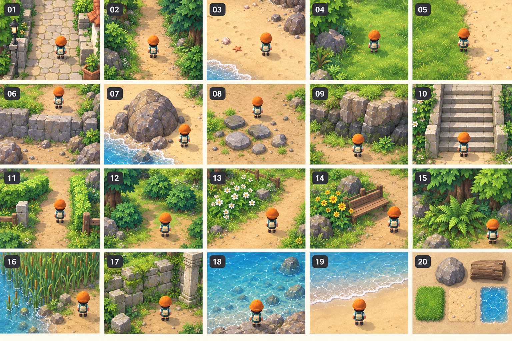

- 04.01: Warmer unregelmäßiger Kopfsteinweg ohne grobe Texturwiederholung
- 04.02: Verdichteter heller Waldpfad mit sanfter Kante
- 04.03: Sand mit wenigen Muschelspuren
- 04.04: Gras mit größeren ruhigen Massen und kleinen Randhalmen
- 04.05: Scharfe begehbare Gras-Sand-Grenze
- 04.06: Kurzer Steinabsatz als verständliche Weltgrenze
- 04.07: Großer gerundeter Strandfelsen mit sekundären Brüchen
- 04.08: Kleine Gruppe flacher Lesesteine
- 04.09: Gestufte Felswand mit dunklem Fuß und heller Kante
- 04.10: Breite Steintreppe mit fünf klaren Stufen
- 04.11: Niedrige Hecke als Wegrahmen
- 04.12: Buschgruppe mit freiem Interaktionsraum
- 04.13: Weiße Blumen am unkritischen Wegrand
- 04.14: Gelbe Wildblumen neben einer Bank
- 04.15: Farn unter einer Baumkrone
- 04.16: Schilf am Wasser ohne verdecktes Rätselobjekt
- 04.17: Moosige Mauer an der Ruine
- 04.18: Ruhige blaue Wasserfläche mit heller flacher Uferzone
- 04.19: Schmale sanfte Schaumkante am Strand
- 04.20: Materialvergleich Stein, Holz, Gras, Sand und Wasser

## Tafel 05 · Küstenort und Ankunft

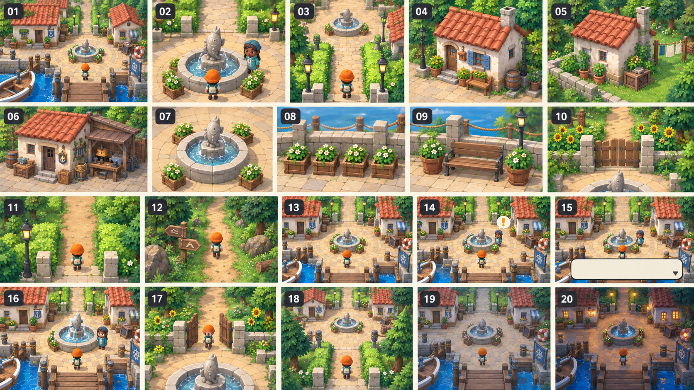

- 05.01: Vollständiger Ankunftsplatz aus hoher fester Spielkamera
- 05.02: Erster Bildausschnitt mit Mara und deutlich sichtbarem Brunnen
- 05.03: Einfacher Weg vom Startpunkt zum Brunnen
- 05.04: Kleines cremefarbenes Wohnhaus mit Terrakottadach
- 05.05: Hausrückseite mit plausibler Wanddicke
- 05.06: Werkstatthaus mit offenem Vordach
- 05.07: Steinbrunnen mit klarer achtteiliger Schale
- 05.08: Vier gleiche Samenkästen am Platzrand
- 05.09: Bank und zwei Pflanzkübel als Ruheecke
- 05.10: Gartenpforte sichtbar vom Brunnen
- 05.11: Pfadöffnung zwischen Hecken
- 05.12: Weg aus dem Dorf in den Wald
- 05.13: Dorfansicht ohne UI für Lesbarkeitsprüfung
- 05.14: Dorfansicht mit einem kleinen Interaktionshinweis
- 05.15: Dorfansicht mit ruhigem unteren Dialogfenster
- 05.16: Dorf bei gelöstem Brunnenrätsel mit kleinem Wasserfluss
- 05.17: Dorf mit geöffnetem Gartentor
- 05.18: Kurze Rückkehr zum Dorf ohne neue Blockade
- 05.19: Dorf bei bewölktem Licht ohne Verlust der Klarheit
- 05.20: Dorf als abendliche spätere Variante mit derselben Route

## Tafel 06 · Waldweg und Garten

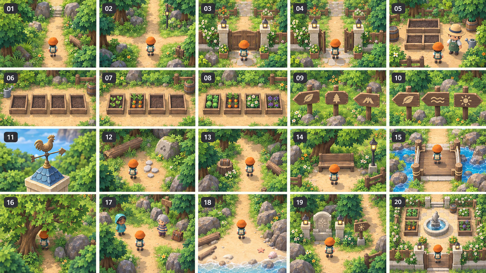

- 06.01: Gerader Waldweg mit Ausgang im oberen Bildbereich
- 06.02: Kleine Waldkreuzung mit einer klaren Hauptfortsetzung
- 06.03: Gartenpforte vor dem Öffnen
- 06.04: Gartenpforte nach dem Öffnen mit freiem Durchgang
- 06.05: Jona neben vier leeren Samenkästen
- 06.06: Gleiche Samenkästen in einer ruhigen Reihe
- 06.07: Zwei befüllte von vier Samenkästen als Mengenansicht
- 06.08: Vier befüllte Samenkästen als Mengenansicht
- 06.09: Drei unterschiedliche Holzwegzeichen
- 06.10: Wegzeichen Blatt, Welle und Sonne, ohne Lösungsreihenfolge
- 06.11: Wetterfahne als Formhinweis
- 06.12: Kleine logische Spur am Wegrand
- 06.13: Kurzer Seitenweg mit optionalem Fund
- 06.14: Bank als Rückkehrpunkt
- 06.15: Niedrige Brücke über einen dekorativen Bach
- 06.16: Baumverdeckung mit ausgedünnter Krone über Figur
- 06.17: Waldsicht mit begrenzter Zahl an NPCs und Gegenständen
- 06.18: Waldpfad am Übergang zu Sand
- 06.19: Ein Rätselobjekt, Ausgang und Hinweis gleichzeitig im Bild
- 06.20: Gesamter Garten als kompakter Raum ohne Labyrinthfüllung

## Tafel 07 · Strand und Steg

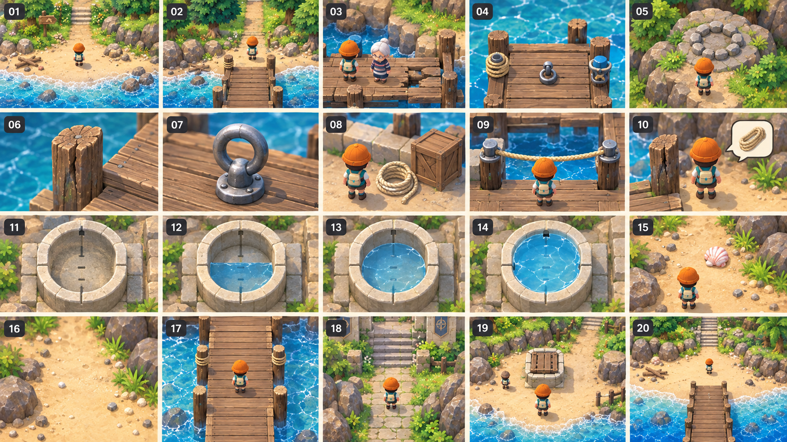

- 07.01: Strandübersicht mit Meer unten und Pfad oben
- 07.02: Ankunft vom Wald mit Steg als Landmarke
- 07.03: Tilda vor dem beschädigten Steg
- 07.04: Steg mit drei klar unterscheidbaren Befestigungsstellen
- 07.05: Intakter Steinring am Felsen
- 07.06: Morscher Holzpfosten mit sichtbarem Riss
- 07.07: Stabiler Metallring am Steg
- 07.08: Lose Seilrolle neben einem Kasten
- 07.09: Seil korrekt zwischen zwei stabilen Ringen gespannt
- 07.10: Fehlversuch am morschen Pfosten, Seil bleibt im Inventar
- 07.11: Messbecken mit vier gleichen Teilmarkierungen
- 07.12: Halb gefülltes Messbecken
- 07.13: Dreiviertel gefülltes Messbecken
- 07.14: Voll gefülltes Messbecken
- 07.15: Eine gut erkennbare Muschel als Fund am Hauptweg
- 07.16: Muschel nach dem Aufheben: leere Stelle bleibt natürlich
- 07.17: Steg nach der Reparatur mit breiter sicherer Lauffläche
- 07.18: Übergang vom Strand zur Ruinentreppe
- 07.19: Strand mit geschlossenem Rätsel und freier Rückroute
- 07.20: Strand als Gesamtbild ohne übergroße Statusfenster

## Tafel 08 · Ruinen und Küstenfeuer

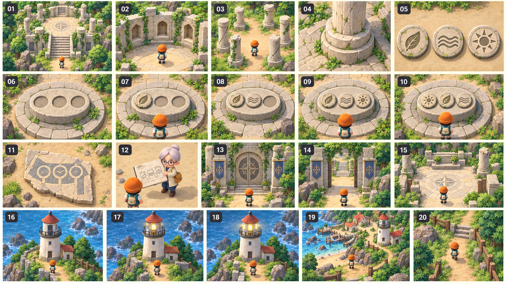

- 08.01: Ruinenübersicht mit breiter mittlerer Treppe
- 08.02: Ankunft am Sockel mit drei leeren Laternennischen
- 08.03: Sechs Säulen mit individuellen kleinen Kantenbrüchen
- 08.04: Säulenfuß und runde Sockeldicke
- 08.05: Drei Symbolscheiben mit Blatt, Welle und Sonne
- 08.06: Leerer Symbolsockel mit drei klaren Steckplätzen
- 08.07: Sockel mit einer Scheibe eingesetzt
- 08.08: Sockel mit zwei Scheiben eingesetzt
- 08.09: Sockel mit drei Scheiben, noch nicht geprüft
- 08.10: Falsche Reihenfolge bleibt austauschbar
- 08.11: Mosaikfragment als räumlicher Reihenfolgehinweis
- 08.12: Elin mit offener kurzer Zeichnung
- 08.13: Ruinentor vor der Freischaltung
- 08.14: Ruinentor nach der Freischaltung
- 08.15: Ruhige Terrasse hinter dem Tor
- 08.16: Küstenfeuer im unbeleuchteten Ausgangszustand
- 08.17: Küstenfeuer mit einem aktiven Licht
- 08.18: Küstenfeuer mit drei aktiven Lichtern
- 08.19: Abschlussblick über Strand und Dorf
- 08.20: Rückweg nach dem Finale ohne Weltreset

## Tafel 09 · Gegenstände und Inventar

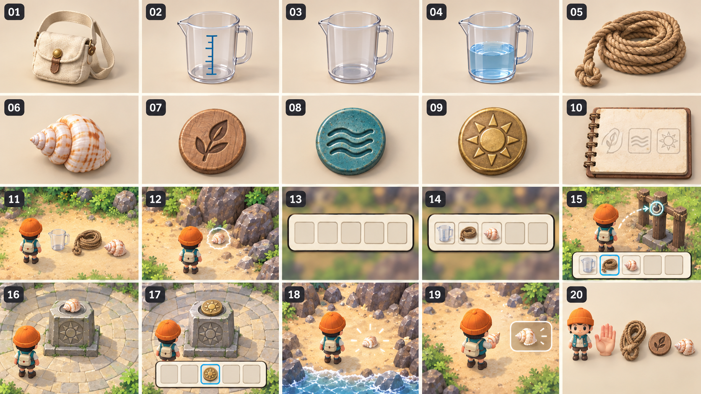

- 09.01: Originale kleine cremefarbene Stofftasche
- 09.02: Messschale mit klarer Volumenmarkierung
- 09.03: Leere Messschale
- 09.04: Halb gefüllte Messschale
- 09.05: Seilrolle mit großem gut greifbarem Ende
- 09.06: Muschel mit einzigartiger Spiralsilhouette
- 09.07: Blattscheibe aus mattem Holz
- 09.08: Wellenscheibe aus blaugrünem Keramikmaterial
- 09.09: Sonnenscheibe aus warmem Messing
- 09.10: Skizzenbuch mit drei freien Stecksymbolen
- 09.11: Drei Gegenstände nebeneinander im Weltmaßstab
- 09.12: Ein Fund mit kleiner heller Kontur ohne Dauerleuchten
- 09.13: Inventarleiste mit sechs leeren klaren Plätzen
- 09.14: Inventar mit Messschale, Seil und Muschel
- 09.15: Ausgewähltes Seil mit sichtbarem Verwendungsziel
- 09.16: Falscher Gegenstand am Sockel bleibt erhalten
- 09.17: Eingesetzte Scheibe sichtbar in Welt und Inventarstatus
- 09.18: Muschelfund als kleiner Entdeckungsmoment
- 09.19: Kleine Bestätigung nach Aufheben ohne großes Modal
- 09.20: Größenvergleich Hand, Seil, Scheibe und Muschel

## Tafel 10 · Schulaufgaben als Weltaktionen

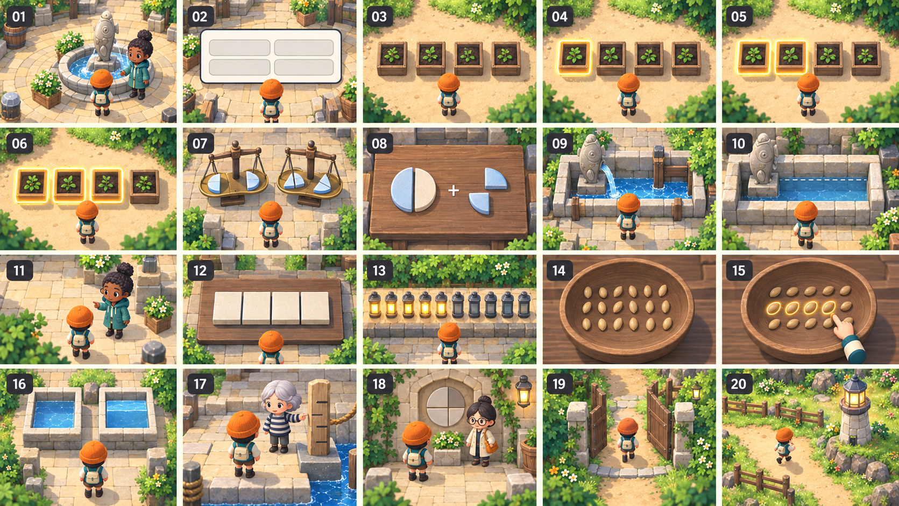

- 10.01: Mara am Brunnen fragt nach einem Anteil, ohne riesigen Fragebogen
- 10.02: Ruhiges Antwortfenster mit vier großen neutralen Antwortflächen ohne Text
- 10.03: Mengenwahl an vier gleichen Samenkästen
- 10.04: Eine von vier gleich großen Flächen hervorgehoben
- 10.05: Zwei von vier gleich großen Flächen hervorgehoben
- 10.06: Drei von vier gleich großen Flächen hervorgehoben
- 10.07: Gleichwertige Bruchmengen an zwei Messschalen
- 10.08: Ein Ganzes aus einer Hälfte und zwei Vierteln in ruhiger Mengenansicht
- 10.09: Wasser fließt nach korrekter Mengenwahl
- 10.10: Falsche Mengenwahl zeigt tatsächlichen Füllstand
- 10.11: Kurzer hilfreicher NPC-Dialog nach Fehler
- 10.12: Hinweis visualisiert gleich große Teilstücke
- 10.13: Prozentanteil an zehn gleichen Laternenpunkten
- 10.14: Zwanzig gleiche Saatkörner in ruhiger Schale
- 10.15: Auswahl von fünf gleichen Saatkörnern
- 10.16: Vergleich zweier gleich großer Becken
- 10.17: Tilda erklärt eine Messmarke im Gespräch
- 10.18: Elin fragt nach einem Bruch vor einer Nische
- 10.19: Eine gelöste Aufgabe öffnet sichtbare Gartenpforte
- 10.20: Schulaufgabenabschluss mit kleiner Weltwirkung und freier Bewegung

## Tafel 11 · Logische Rätsel und Zustände

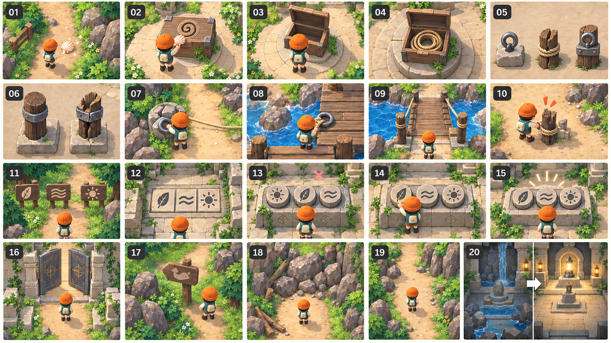

- 11.01: Muschelfund am Pfad als klare Aufsammelhandlung
- 11.02: Muschel passt mechanisch in eine spiralförmige Vertiefung
- 11.03: Muschel öffnet ein kleines Geheimfach
- 11.04: Spiralförmiges Fach mit gefundenem Seil
- 11.05: Drei Seilpunkte mit erkennbar verschiedenen Materialien
- 11.06: Intakte und rissige Befestigung im direkten Vergleich
- 11.07: Seilanfang korrekt am Steinring
- 11.08: Seilende korrekt am Metallring
- 11.09: Reparierter Steg als Folge beider Anschlüsse
- 11.10: Reversibler Fehlversuch am morschen Pfosten
- 11.11: Drei Bildsymbole am Waldweg als Hinweisquelle
- 11.12: Symbolmosaik neben Ruinensockel
- 11.13: Drei Scheiben in falscher Reihenfolge, neutrale Rückmeldung
- 11.14: Eine Scheibe wird gezielt ausgetauscht
- 11.15: Symbole in begründeter Reihenfolge
- 11.16: Torbewegung nach manueller Prüfung
- 11.17: Optionales lustiges Wegzeichen als Nebenfund
- 11.18: Geschlossener Weg mit lesbarem Grund
- 11.19: Geöffneter Weg ohne unnötige Wiederholung
- 11.20: Vorher-nachher Vergleich eines gelösten Raums

## Tafel 12 · Kamera und Bedienoberfläche

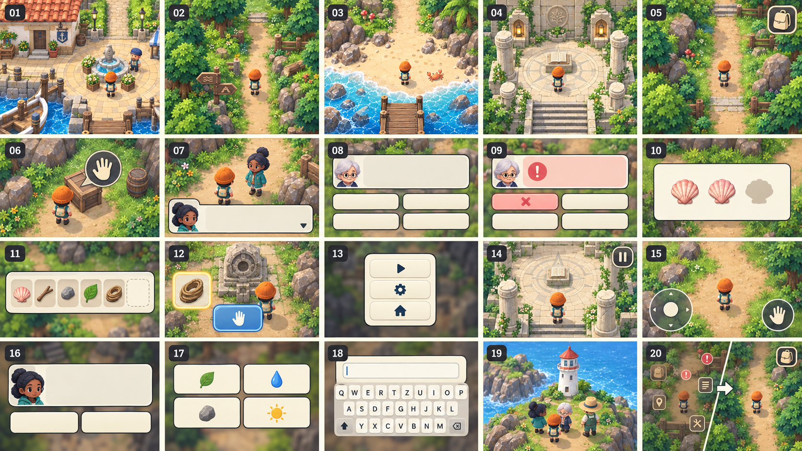

- 12.01: Dorf aus fester hoher Vogelperspektive
- 12.02: Wald aus derselben Kamera mit gleicher Figurgröße
- 12.03: Strand aus derselben Kamera mit gleichem Nordbezug
- 12.04: Ruine aus derselben Kamera ohne Horizont
- 12.05: Ruhiges Weltbild mit nur Taschenknopf
- 12.06: Großer einzelner kontextueller Interaktionsknopf
- 12.07: Gesprächsfenster unten mit klarer Personenzuordnung
- 12.08: Fragefenster mit genau vier Antwortknöpfen
- 12.09: Fehlerhinweis lokal im selben Dialog
- 12.10: Hinweisfläche mit einfacher Mengenzeichnung
- 12.11: Inventar als kurze sechsplatzige Leiste
- 12.12: Ein ausgewählter Gegenstand mit großer Benutzenfläche
- 12.13: Pause mit wenigen getrennten Optionen
- 12.14: Rückkehr zum Spiel ohne neue Kameraposition
- 12.15: Touchlandschaft mit getrennten Bewegungs- und Interaktionsbereichen
- 12.16: Touchdialog ohne aktiven Bewegungsbereich
- 12.17: Große Antwortflächen mit Abstand für Finger
- 12.18: Tastaturfokus mit klarer ruhiger Kontur
- 12.19: Kurze Abschlussansicht vor lebendiger Welt
- 12.20: Vergleich von unübersichtlichem und aufgeräumtem Bild, Schwerpunkt auf freier Welt
