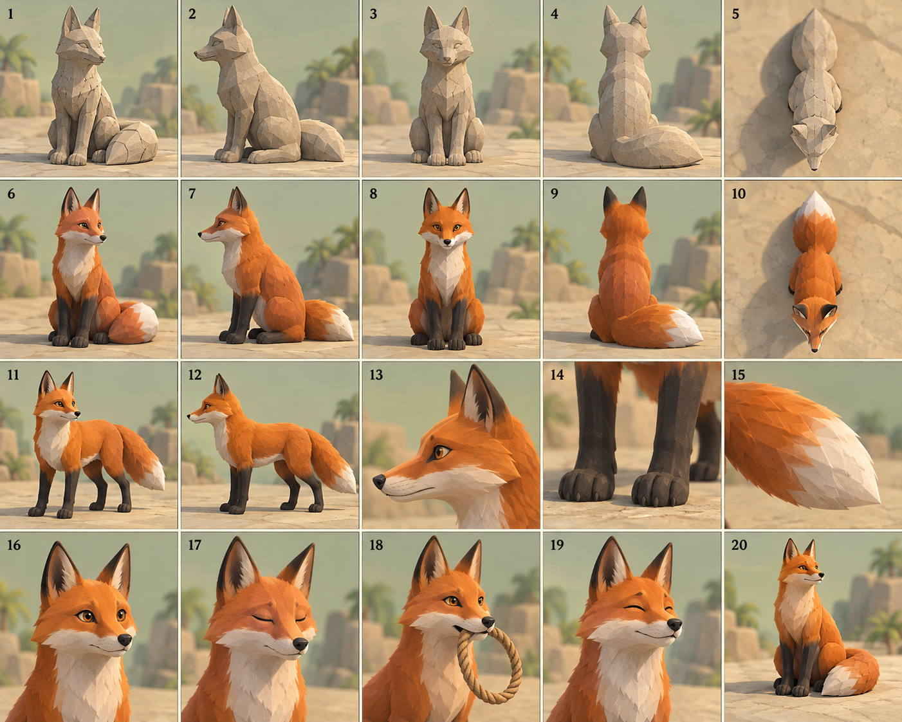
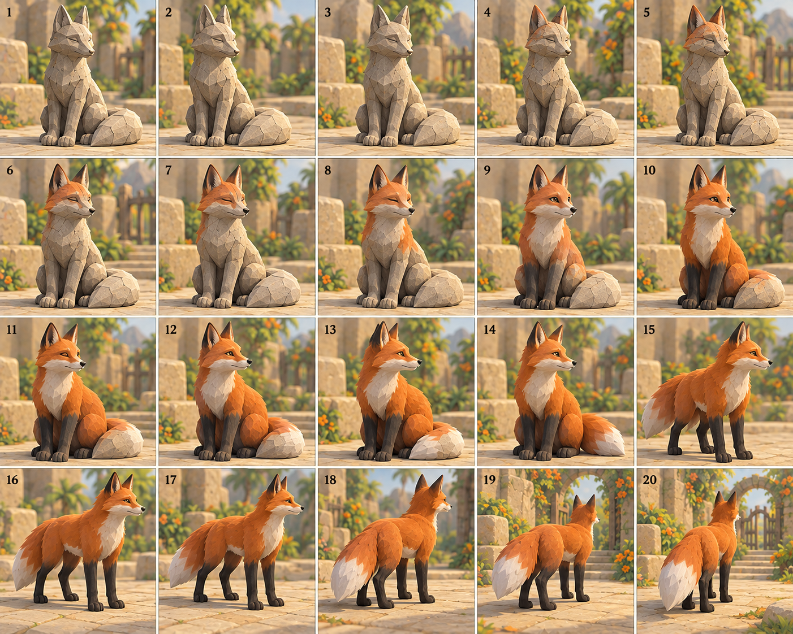
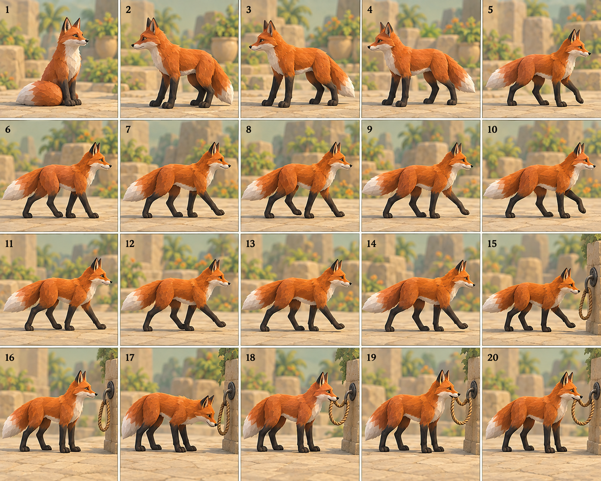
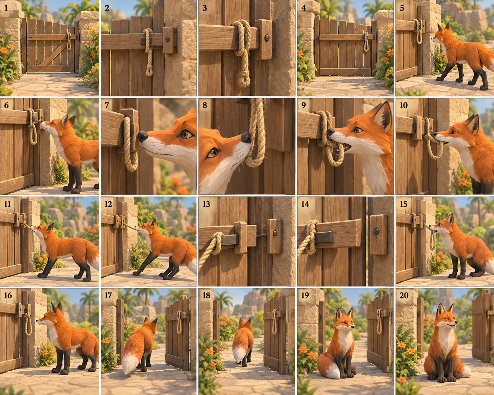
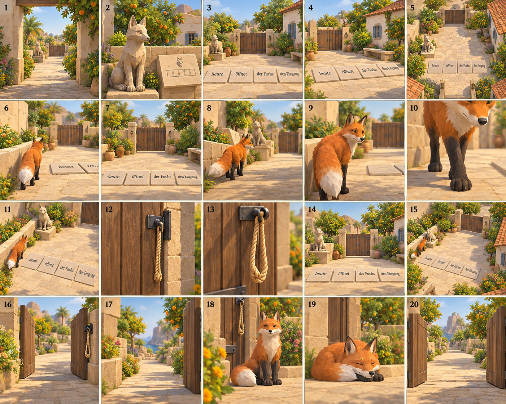
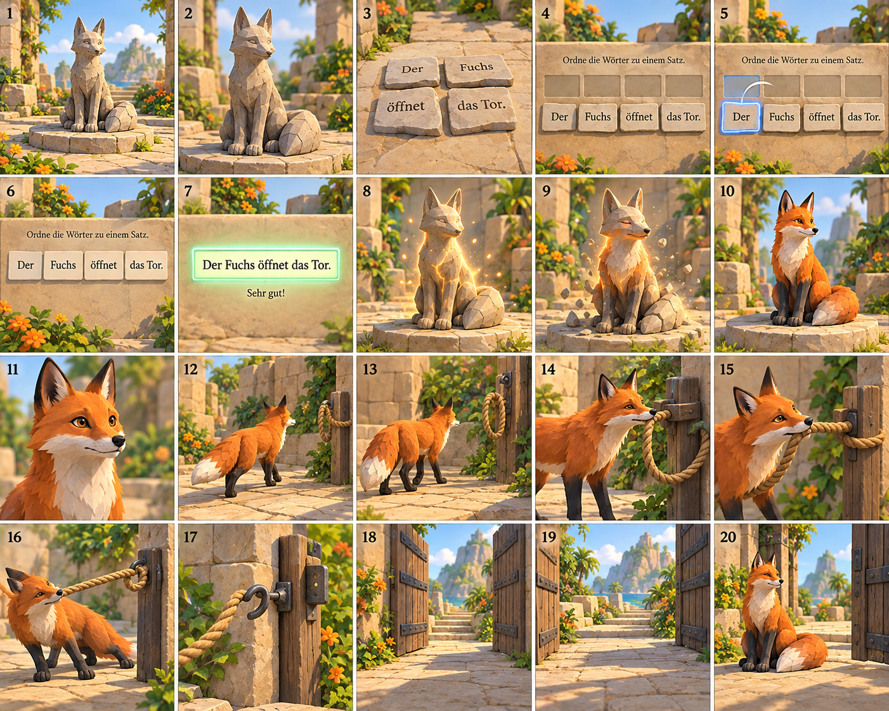

# Messbecher, Fuchs und Steuerung

Task GC-GAMES-ESCAPE-VISUAL-01, vorhandener Unreal-Prototyp und Draft-PR #175. Martins neuer Durchlauf bestätigt die frühe Aufgabenführung und die erste Wasseraufgabe. Diese Erweiterung verbessert den folgenden Bereich und ergänzt die Fuchsszene.

## Direkt testen

Alte Spielsitzung schließen und **Lerninsel starten.command** erneut öffnen. Mit **Esc** öffnet sich das Pausenmenü. Dort stehen der Mausregler und nach gelöstem Satzrätsel **Fuchsaktion erneut ansehen**. Die Wiederholung setzt den Spieler vor die Szene; Antworten, Wassermengen und Lernfortschritt bleiben erhalten.

Beim ersten Durchlauf erwacht der Fuchs, sobald der Satz aus den vier vorhandenen Teilen richtig gelegt und geprüft wurde. Die Figur im Spiel besteht aus beweglichen prozeduralen 3D-Teilen. Sie ist einfacher als die Konzeptkunst. Die Bildtafeln unten sind Bauvorlagen; echte Spielaufnahmen stehen in `games/lerninsel-unreal/Reports/Fox-*.png`.

## Wasseraufgabe hinter der 3/10-Probe

Die erste Aufgabe bleibt: Den Messbecher mit einer Kapazität von **1 Liter** bis **3/10 = 300 ml** füllen und auf die Platte stellen. Danach nimmt man denselben Becher wieder auf. Das erste Tor bleibt gelöst.

An der nächsten Station gibt es:

- einen kleinen Hahn: **+100 ml = +1/10 Liter**;
- einen großen Hahn: **+200 ml = +1/5 Liter**;
- einen Ablauf: **−100 ml = −1/10 Liter**.

Der Auftrag nennt die Handlung und zeigt die aktuelle Menge sowie den fehlenden Rest. Aus 300 ml werden 1000 ml: 700 ml ergänzen, beispielsweise dreimal 200 ml und einmal 100 ml. Ein 200-ml-Hub bei 900 ml wird vollständig abgelehnt. Es wird weder überfüllt noch heimlich nur eine halbe Portion gegeben.

Den vollen Becher gießt man ins **1-Liter-Zielbecken**. Bei weniger Wasser bleiben Becher und Becken unverändert; die Rückmeldung nennt die fehlende Menge. Bei Erfolg leert sich der getragene Becher, das Becken füllt sich über zwei Sekunden und anschließend öffnet sich das Tor in 1,4 Sekunden. Ein fester Blocker schützt den Durchgang bis zum Ende.

Der frühere gezeichnete Bruchast ist keine Pflichtbedienung mehr. Zwei sichtbare Zulaufäste bilden den neuen Wasserplatz. Ein Hub braucht 0,6 Sekunden und Nähe zum gewählten Hahn. Mehrfaches Drücken während eines Hubs zählt einmal. Pause, Fokusverlust oder Weggehen brechen unbestätigte Portionen ab.

**LI3** speichert den neuen Eingießnachweis. **LI1 und LI2** werden weiter gelesen. Bereits gelöste alte Bruchwege bleiben gültiger Fortschritt. Es wird kein zusätzlicher Messbecher erzeugt.

## Fuchsablauf

| Zeit ab richtiger Satzlösung | Sichtbare Aktion |
| --- | --- |
| 0–1,6 s | Grauer Stein wird warmes Fuchsorange; Augen öffnen sich. |
| 1,6–2,4 s | Der Fuchs steht auf und dreht sich. |
| 2,4–6,4 s | Er läuft auf einem festen linken Weg zum Tor; Pfoten bewegen sich abwechselnd. |
| 6,4–7,4 s | Er greift die Schlaufe mit dem Maul. |
| 7,4–8,4 s | Er tritt zurück und zieht den Riegel 50 cm heraus. |
| 8,4–9,8 s | Das Tor öffnet sich; der Fuchs weicht aus dem Durchgang. |
| 9,8–10,6 s | Er setzt sich weich hin. |
| Danach | Schwanz, Ohren, leichte Atmung und Blinzeln zeigen den Lebendzustand. |

Die richtige Lösung schließt die Aufgabenoberfläche. Der Blick zeigt zunächst zum Fuchs, danach bleibt die Steuerung frei. Ein falscher Satz lässt Statue und Tor unverändert. Pause und ein normaler Spielfokusverlust halten die Folge an. Beim Laden eines bereits gelösten Satzes erscheint der lebende Fuchs in der Endpose. **Fuchsaktion erneut ansehen** wiederholt nur die Szene und bewahrt die Lernantworten. Derselbe Actor wird wiederverwendet.

Die Szene verwendet eine fest programmierte Bewegungskette. Sie ist kein NavMesh-System und keine physikalische Seilsimulation. Die Seilform folgt dem tatsächlichen Maulpunkt; Riegel und Tür werden zeitlich damit verbunden.

## Steuerung

Die Figur läuft jetzt mit **420 cm/s statt 230 cm/s**. Der Mausregler reicht von **25 % bis 300 %**, Standard ist **100 %**. Zusätzlich gibt es **Langsamer**, **Standard** und **Schneller**. Beide Blickachsen werden gleich skaliert. Einstellungen werden getrennt vom Spielstand gespeichert. Die Tastatur- und Touchbewegung behalten ihre eigenen Eingaberegeln.

## Bildtafeln: 120 Studien

Sechs erfolgreiche Aufrufe des eingebauten `image_gen` erzeugten je 20 nummerierte Studien. Insgesamt wurden bislang **26 Bildaufrufe und 385 Konzeptmotive** erstellt. Das sind keine 120 fertigen 3D-Assets. Original-PNGs und Prompts stehen in `generierung.json`. Der frühere 280-seitige Bauatlas bleibt erhalten; dieser Nachtrag steht separat. Keine alte Generation wurde wiederholt.

### Abweichungen der Vorlagen

- Tafel 5 zeigt teilweise Stein- und lebenden Fuchs gleichzeitig. Im Spiel existiert nur derselbe Actor.
- Tafel 6 verändert die Satzteile. Im Spiel bleiben **heute / öffnet / der Fuchs / den Eingang** und alle sechs gültigen V2-Folgen erhalten.
- Leuchtende Risse und Partikel sind nicht implementiert. Gebaut sind der Farbwechsel, bewegliche Körperteile und die Riegelaktion.
- Die Auswahl bleibt eine vollständig gefärbte Fläche ohne Häkchen auf Wortsteinen.

## Prüfung und nächste Abnahme

Die Prüfungen umfassen native Reglerbedienung und Speicherladen, die Identität des wiederverwendeten Bechers, Mengenänderungen, Abbruch, Kapazität, Eingießen, die Fuchszustände und echte Tor-Collision-Sweeps.

Ein erster offener Tor-Sweep startete die Testfigur im Boden: `Actor_0`, Normalenrichtung Z, `StartPenetrating`. Die Gegenprobe mit 90 cm Standhöhe war frei. Die Testpose wurde korrigiert; das Spieltor hatte nicht blockiert. Rote Berichte bleiben erhalten.

Letzter vollständiger Lauf vor dem Schlussreview: **2026.10.08-16.56.16 UTC**, **195 portable Prüfungen (64+88+7+24+12)**, **vier UE-Tests**, **null Fehler**, **acht Epic-Umgebungswarnungen**. Native Widget-Evidenz ist keine menschliche OS-, Kinder- oder iPad-Abnahme. Der endgültige Bericht steht in `Production/WATER-FOX-REVIEW.md`.

Nächster Schritt: Martin prüft die tatsächliche Animation und die 1000-ml-Aufgabe im aktualisierten Prototypen. Browser, echtes iPad, die übrigen Inselgebiete und Audio bleiben eigene Ausbauschritte.
