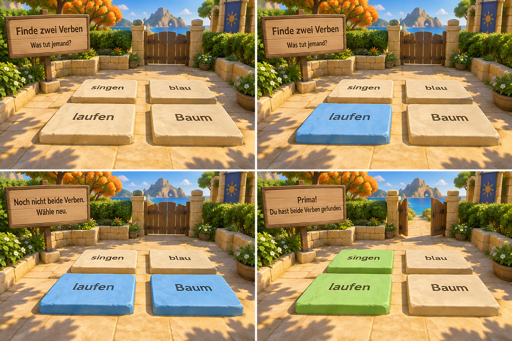

# Lerninsel – Aufgabenführung nach Martins erstem Spieltest

Task GC-GAMES-ESCAPE-VISUAL-01. Bestehender Unreal-Branch `feature/lerninsel-ego-v1`, Draft-PR175. Diese Änderung betrifft die Verständlichkeit und Bedienung. Die bisherige Optik bleibt für die Mechanikprüfung ausreichend; keine neue Renderingproduktion.

## Verbindliche Korrektur

Martin konnte die erste Verbprobe lösen, verstand den zweiten Abschnitt aber nicht und kam deshalb nicht weiter. Zielgruppe umfasst Kinder mit schwächeren Deutschkenntnissen und Lernschwierigkeiten. Aufgaben müssen das Ziel, die Handlung und die Verbesserung verständlich erklären. „Artikel/Nomen/Verb je Reihe“ war ein Beispiel für verständliche Aufgabenführung, keine beschlossene Umstellung aller drei Reihen auf andere Wortarten. Der vorhandene zweite Bereich bleibt ein Verbweg.

Neuester Nutzerwunsch: Der **ganze Stein** färbt sich. **Kein Häkchen** auf dem Stein. Die Wortbeschriftung bleibt dunkel lesbar. Kein zweites Bestätigungsfenster bei der Verbprobe und beim Verbweg. Blau bedeutet ausgewählt; grün erscheint erst nach vollständiger korrekter Lösung. Beim Verbweg kennzeichnet ein orangefarbener Stein mit ! einen falschen Schritt. ! ist eine Fehlerhilfe, kein Auswahlhäkchen.

## Konkreter Ablauf

1. Verbprobe: Dauerhafter Auftrag „Finde zwei Verben“. Erklärung „Was tut jemand?“. Ein gezielter Klick oder E in Reichweite wählt genau ein Wort aus. Ein weiterer bewusster Klick nimmt es zurück. Höchstens zwei Wörter zugleich. Die beiden richtigen Wörter öffnen das Tor automatisch. Ein falsches Paar bleibt korrigierbar und bekommt eine Erklärung statt eines bloßen Falsch-Signals.
2. Verbweg: Dauerhafter Auftrag „Gehe von vorne nach hinten. Wähle in jeder Reihe ein Verb: Was tut jemand?“. Drei Reihen sind im Raum nummeriert. Startstein bleibt verfügbar; ein gezielter erster Wortklick startet und wählt in einem Schritt. Aktives Betreten mit 0,30 Sekunden Kontakt bleibt möglich. Keine Überspringung späterer Reihen. Richtige drei Schritte öffnen das Tor automatisch. Falscher Schritt: dauerhaft sichtbare Anleitung zum Stein „Schritt zurück“ links; dann die aktuelle Reihe erneut lösen.
3. Satzgarten: „Baue einen Satz, der etwas erzählt. Klicke alle vier Teile in deiner Reihenfolge. Das Verb ‚öffnet‘ gehört auf Platz 2.“ Ein anderes Beispiel zeigt die Regel. Die Satzvorschau und die Platzfolge sind sichtbar. Bereits gelegte Teile färben ihre Bedienflächen blau. Neu beginnen und letzten Teil zurück bleiben direkt erreichbar. Alle sechs vorhandenen V2-Satzfolgen bleiben gültig; kein fester alleiniger Lösungssatz.
4. Wasserterrasse: Ein Liter Kapazität, 100 ml pro Hub, Ziel 3/10 Liter = 300 ml bleiben unverändert. Der Auftrag nennt Eimer aufnehmen, füllen und auf die Platte stellen.
5. Bruchleitung: Auftrag nennt Start, Ziel, genau einen Ast und die Summe 1.
6. Felsfenster: Erst die vier Reliefs unten finden, dann drei Anteile für ein Ganzes auswählen, anschließend Aussicht und Blickhilfe.

## Bildvorlage

Die Tafel ist ein generierter Gestaltungsentwurf, kein Unreal-Screenshot. Sie zeigt neutral, eine blaue Auswahl, ein falsches Paar und korrekte grüne Steine mit offenem Tor. Wortanordnung und Farbwechsel sind konsistent. Die dargestellte hochwertigere Steinoberfläche ist kein Versprechen eines neuen Artpasses. Im Runtime wird dieselbe Auswahl über den vollständigen Materialfarbwechsel umgesetzt.

Eingebautes image_gen: ein neuer erfolgreicher Aufruf, vier Ansichten auf einer Tafel. Bisherige 19 Aufrufe bleiben erhalten: jetzt insgesamt20 Aufrufe und265 Konzeptmotive. Keine neuen Assets gekauft, keine Cloud-GPU, keine Web-/Production-Veröffentlichung. Prompt und Werkzeugnachweis in generierung.json.

## Abnahme und offene Punkte

Die neuen Ablaufregressionen wurden zunächst mit sechs Fehlern gegen die alte Steuerung ausgeführt. Ein späterer tatsächlicher Materialtest fand zusätzlich, dass CreateDynamicMaterialInstance vorhandene dynamische Materialien wiederverwenden kann: Die Steine teilten sich deshalb ihre Farbparameter. Ein eigenes Material pro Stein korrigiert diese Ursache; der endgültige Prüfnachweis steht in Production/LEARNING-REVIEW.md.

Martins erster Durchlauf ist Nutzerfeedback, keine Abnahme der neuen Version. Nächster Schritt: Erneuter Durchlauf durch den Verbweg und Satzgarten. Verständlichkeit für die tatsächlichen Kinder bleibt durch Nutzertests zu prüfen. iPad und Browserhosting bleiben offen.
