# Bildkatalog: 240 zusätzliche Produktionsmotive

Zwölf Tafeln, jeweils20 Motive. Zusammen mit den bisherigen21 Motiven ergeben sich261 Konzeptansichten. Die Zahl bezeichnet Bildfelder, keine fertig modellierten Assets. Zielbilder bestimmen Formen; exakte Schrift, Mathematik, Mengen und Kollisionsgeometrie kommen aus dem Bauvertrag.

## Tafel 01: Baumfamilien
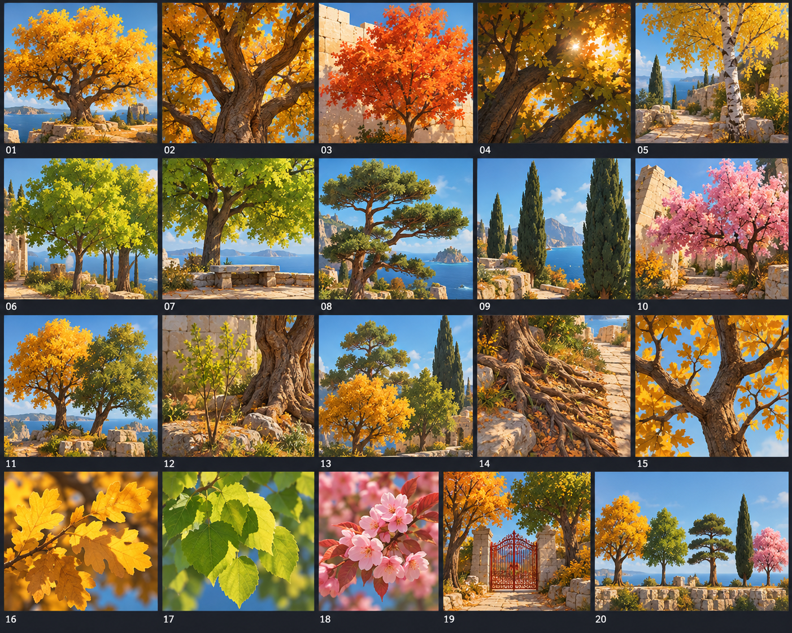
20 Baumstudien: Silhouette, Schichtung, Wurzeln und Blickachsen

- **01.01**: Goldene Eiche, gesamte unregelmäßige Krone.
- **01.02**: Eiche mit sichtbarer Verzweigung aus Augenhöhe.
- **01.03**: Orange Ahornkrone vor heller Mauer.
- **01.04**: Schattiger Kronenkern und warme Blattspitzen.
- **01.05**: Birke mit hellem Stamm am sicheren Nebenweg.
- **01.06**: Lindenfamilie in limettengrün.
- **01.07**: Linde über einer Steinbank, freie Sicht darunter.
- **01.08**: Kiefer mit gestaffelten horizontalen Kronen.
- **01.09**: Schlanke Zypresse als Turmrahmung.
- **01.10**: Rosa Blütenbaum, zurückhaltende Akzentfarbe.
- **01.11**: Doppelbaumgruppe ohne identische Silhouette.
- **01.12**: Junger Baum neben altem verzweigtem Stamm.
- **01.13**: Drei Kronenhöhen als Tiefenstaffelung.
- **01.14**: Wurzeln am Weg außerhalb der Gehfläche.
- **01.15**: Astgabel und kleine Zweige im Detail.
- **01.16**: Goldene Blattgruppe aus drei Lichtwerten.
- **01.17**: Lime Blattgruppe bei gleicher Materialwirkung.
- **01.18**: Rosa Blattgruppe bei gleicher Materialwirkung.
- **01.19**: Bäume rahmen ein rotes Tor ohne es zu verdecken.
- **01.20**: Fünf ausgewählte Familien als Größenvergleich.

Übernahme: passende Familien auswählen; nicht jede Ansicht als anderes Modell bauen. Prüfen: Silhouette, Material, Blickfreiheit und dargestellter Zustand. Zahlen, Gategap, Signalanzahl und UI bleiben gesonderte Daten-/Engineprüfungen.

## Tafel 02: Boden und Küste
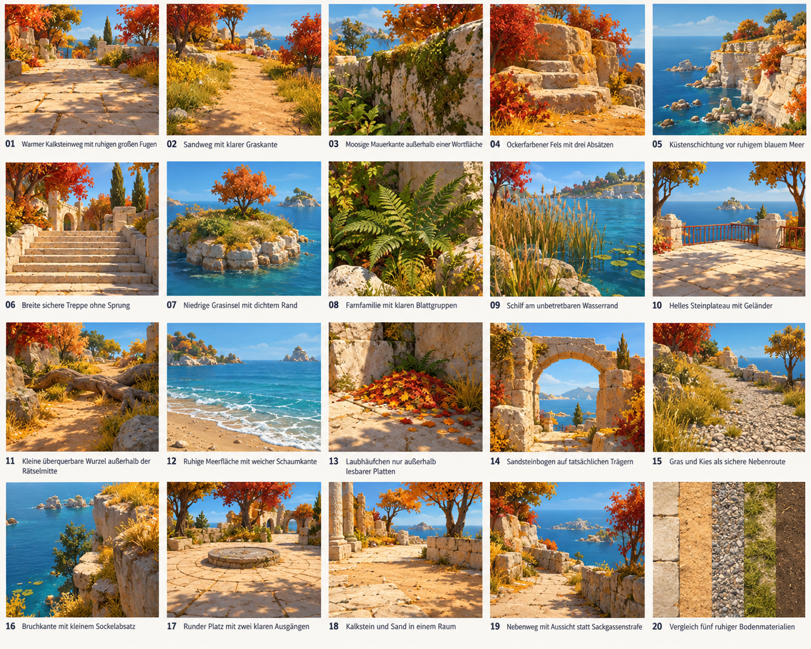
20 Material- und Landschaftsstudien

- **02.01**: Warmer Kalksteinweg mit ruhigen großen Fugen.
- **02.02**: Sandweg mit klarer Graskante.
- **02.03**: Moosige Mauerkante außerhalb einer Wortfläche.
- **02.04**: Ockerfarbener Fels mit drei Absätzen.
- **02.05**: Küstenschichtung vor ruhigem blauem Meer.
- **02.06**: Breite sichere Treppe ohne Sprung.
- **02.07**: Niedrige Grasinsel mit dichtem Rand.
- **02.08**: Farnfamilie mit klaren Blattgruppen.
- **02.09**: Schilf am unbetretbaren Wasserrand.
- **02.10**: Helles Steinplateau mit Geländer.
- **02.11**: Kleine überquerbare Wurzel außerhalb der Rätselmitte.
- **02.12**: Ruhige Meerfläche mit weicher Schaumkante.
- **02.13**: Laubhäufchen nur außerhalb lesbarer Platten.
- **02.14**: Sandsteinbogen auf tatsächlichen Trägern.
- **02.15**: Gras und Kies als sichere Nebenroute.
- **02.16**: Bruchkante mit kleinem Sockelabsatz.
- **02.17**: Runder Platz mit zwei klaren Ausgängen.
- **02.18**: Kalkstein und Sand in einem Raum.
- **02.19**: Nebenweg mit Aussicht statt Sackgassenstrafe.
- **02.20**: Vergleich fünf ruhiger Bodenmaterialien.

Übernahme: passende Familien auswählen; nicht jede Ansicht als anderes Modell bauen. Prüfen: Silhouette, Material, Blickfreiheit und dargestellter Zustand. Zahlen, Gategap, Signalanzahl und UI bleiben gesonderte Daten-/Engineprüfungen.

## Tafel 03: Architektur und Mechanik
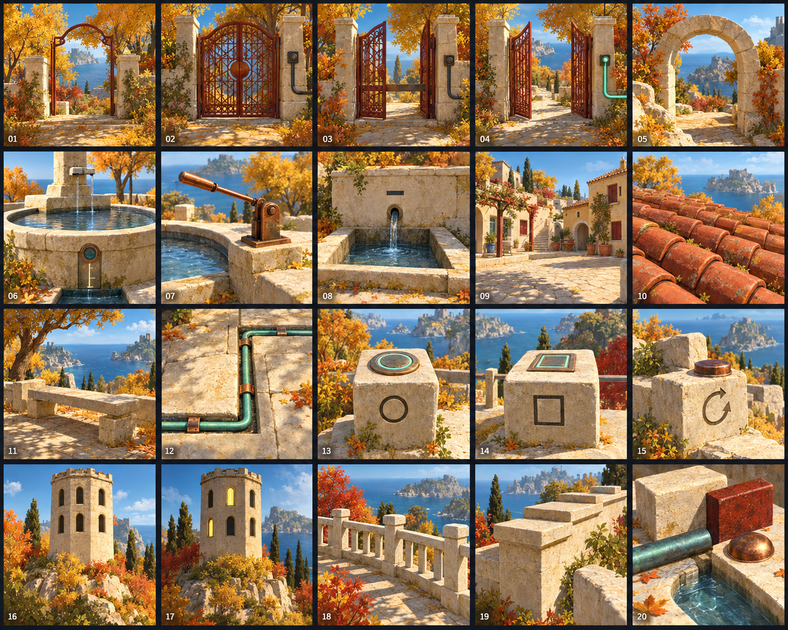
20 original gestaltete Bauobjekte

- **03.01**: Roter Gittertorrahmen mit hellem Steinsockel.
- **03.02**: Tor geschlossen, Kabel dunkel.
- **03.03**: Tor halb geöffnet, Durchgang noch gesperrt.
- **03.04**: Tor vollständig geöffnet, Kabel mint.
- **03.05**: Niedriger Rundbogen am Ankunftspunkt.
- **03.06**: Brunnen mit ruhigem Wasser und Messauslass.
- **03.07**: Füllhebel aus Kupfer neben dem Brunnen.
- **03.08**: Ablassbecken mit eindeutiger Minusmarkierung.
- **03.09**: Satzplatz mit kleinen Häuserfassaden.
- **03.10**: Terrakottadach mit modellierten Reihen.
- **03.11**: Steinbank als Beobachtungslandmarke.
- **03.12**: Kabelkanal eingelassen im Stein.
- **03.13**: Startstein mit rundem Beginn.
- **03.14**: Schlussstein mit eigener Prüfmarke.
- **03.15**: Rücknahmestein am sicheren Rand.
- **03.16**: Turm mit genau acht getrennten Fenstern.
- **03.17**: Turm mit vier hellen und vier dunklen Fenstern.
- **03.18**: Steingeländer mit sichtbaren Pfosten.
- **03.19**: Mauerabschluss mit abgestuften Kappen.
- **03.20**: Eine Materialfamilie Stein Kupfer Rostrot Wasser.

Übernahme: passende Familien auswählen; nicht jede Ansicht als anderes Modell bauen. Prüfen: Silhouette, Material, Blickfreiheit und dargestellter Zustand. Zahlen, Gategap, Signalanzahl und UI bleiben gesonderte Daten-/Engineprüfungen.

## Tafel 04: Verbengarten
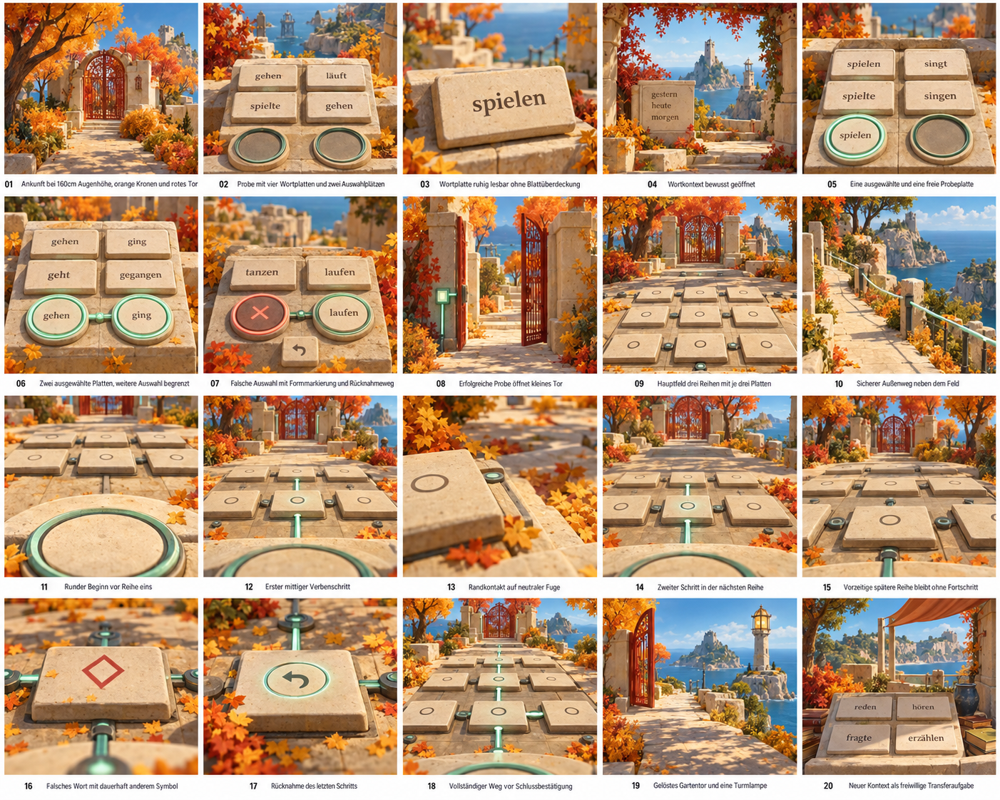
20 Raum- und Zustandsansichten aus Ego-Perspektive

- **04.01**: Ankunft bei160cm Augenhöhe, orange Kronen und rotes Tor.
- **04.02**: Probe mit vier Wortplatten und zwei Auswahlplätzen.
- **04.03**: Wortplatte ruhig lesbar ohne Blattüberdeckung.
- **04.04**: Wortkontext bewusst geöffnet.
- **04.05**: Eine ausgewählte und eine freie Probeplatte.
- **04.06**: Zwei ausgewählte Platten, weitere Auswahl begrenzt.
- **04.07**: Falsche Auswahl mit Formmarkierung und Rücknahmeweg.
- **04.08**: Erfolgreiche Probe öffnet kleines Tor.
- **04.09**: Hauptfeld drei Reihen mit je drei Platten.
- **04.10**: Sicherer Außenweg neben dem Feld.
- **04.11**: Runder Beginn vor Reihe eins.
- **04.12**: Erster mittiger Verbenschritt.
- **04.13**: Randkontakt auf neutraler Fuge.
- **04.14**: Zweiter Schritt in der nächsten Reihe.
- **04.15**: Vorzeitige spätere Reihe bleibt ohne Fortschritt.
- **04.16**: Falsches Wort mit dauerhaft anderem Symbol.
- **04.17**: Rücknahme des letzten Schritts.
- **04.18**: Vollständiger Weg vor Schlussbestätigung.
- **04.19**: Gelöstes Gartentor und eine Turmlampe.
- **04.20**: Neuer Kontext als freiwillige Transferaufgabe.

Übernahme: passende Familien auswählen; nicht jede Ansicht als anderes Modell bauen. Prüfen: Silhouette, Material, Blickfreiheit und dargestellter Zustand. Zahlen, Gategap, Signalanzahl und UI bleiben gesonderte Daten-/Engineprüfungen.

## Tafel 05: Satzplatz
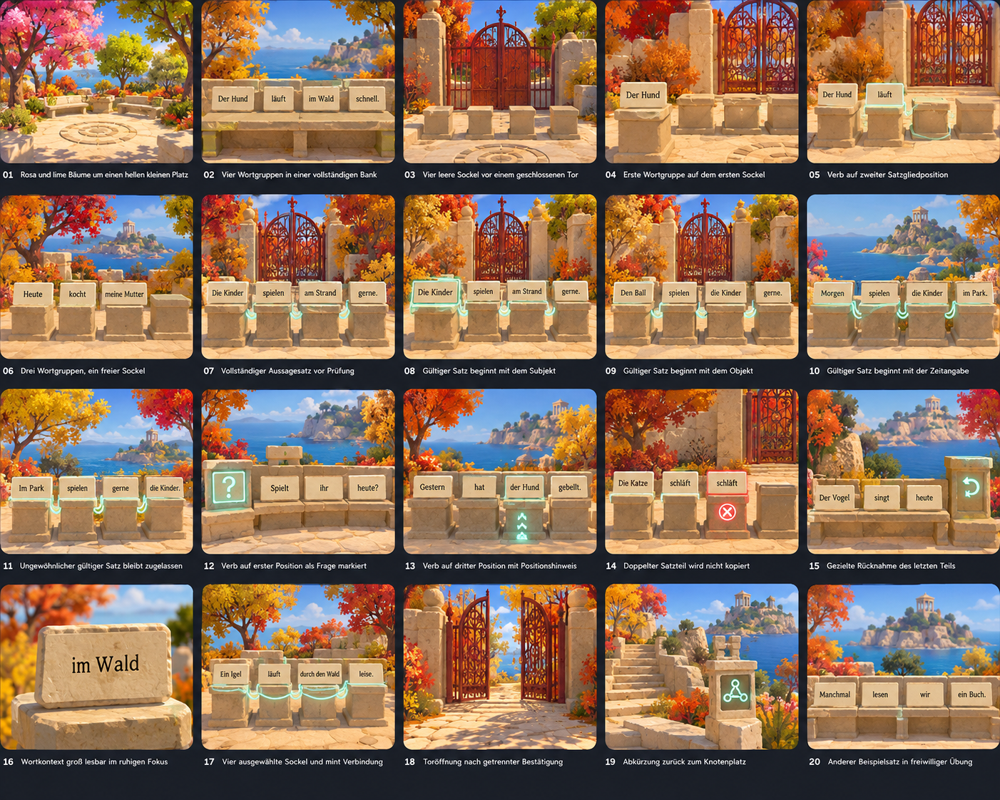
20 Ansichten für Satzglieder und Reihenfolge

- **05.01**: Rosa und lime Bäume um einen hellen kleinen Platz.
- **05.02**: Vier Wortgruppen in einer vollständigen Bank.
- **05.03**: Vier leere Sockel vor einem geschlossenen Tor.
- **05.04**: Erste Wortgruppe auf dem ersten Sockel.
- **05.05**: Verb auf zweiter Satzgliedposition.
- **05.06**: Drei Wortgruppen, ein freier Sockel.
- **05.07**: Vollständiger Aussagesatz vor Prüfung.
- **05.08**: Gültiger Satz beginnt mit dem Subjekt.
- **05.09**: Gültiger Satz beginnt mit dem Objekt.
- **05.10**: Gültiger Satz beginnt mit der Zeitangabe.
- **05.11**: Ungewöhnlicher gültiger Satz bleibt zugelassen.
- **05.12**: Verb auf erster Position als Frage markiert.
- **05.13**: Verb auf dritter Position mit Positionshinweis.
- **05.14**: Doppelter Satzteil wird nicht kopiert.
- **05.15**: Gezielte Rücknahme des letzten Teils.
- **05.16**: Wortkontext groß lesbar im ruhigen Fokus.
- **05.17**: Vier ausgewählte Sockel und mint Verbindung.
- **05.18**: Toröffnung nach getrennter Bestätigung.
- **05.19**: Abkürzung zurück zum Knotenplatz.
- **05.20**: Anderer Beispielsatz in freiwilliger Übung.

Übernahme: passende Familien auswählen; nicht jede Ansicht als anderes Modell bauen. Prüfen: Silhouette, Material, Blickfreiheit und dargestellter Zustand. Zahlen, Gategap, Signalanzahl und UI bleiben gesonderte Daten-/Engineprüfungen.

## Tafel 06: Bruchleitungen
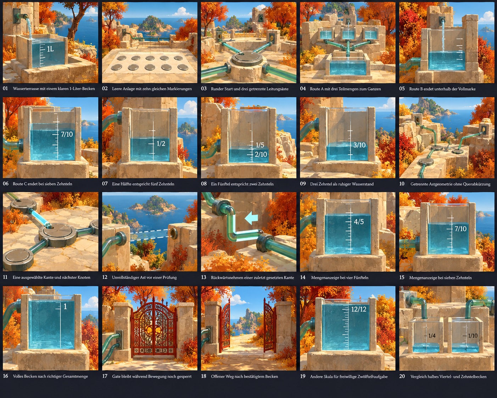
20 Mengen-, Pfad- und Beckenstudien

- **06.01**: Wasserterrasse mit einem klaren1-Liter-Becken.
- **06.02**: Leere Anlage mit zehn gleichen Markierungen.
- **06.03**: Runder Start und drei getrennte Leitungsäste.
- **06.04**: RouteA mit drei Teilmengen zum Ganzen.
- **06.05**: RouteB endet unterhalb der Vollmarke.
- **06.06**: RouteC endet bei sieben Zehnteln.
- **06.07**: Eine Hälfte entspricht fünf Zehnteln.
- **06.08**: Ein Fünftel entspricht zwei Zehnteln.
- **06.09**: Drei Zehntel als ruhiger Wasserstand.
- **06.10**: Getrennte Astgeometrie ohne Querabkürzung.
- **06.11**: Eine ausgewählte Kante und nächster Knoten.
- **06.12**: Unvollständiger Ast vor einer Prüfung.
- **06.13**: Rückwärtsnehmen einer zuletzt gesetzten Kante.
- **06.14**: Mengenanzeige bei vier Fünfteln.
- **06.15**: Mengenanzeige bei sieben Zehnteln.
- **06.16**: Volles Becken nach richtiger Gesamtmenge.
- **06.17**: Gate bleibt während Bewegung noch gesperrt.
- **06.18**: Offener Weg nach bestätigtem Becken.
- **06.19**: Andere Skala für freiwillige Zwölftelaufgabe.
- **06.20**: Vergleich halbes Viertel- und Zehntelbecken.

Übernahme: passende Familien auswählen; nicht jede Ansicht als anderes Modell bauen. Prüfen: Silhouette, Material, Blickfreiheit und dargestellter Zustand. Zahlen, Gategap, Signalanzahl und UI bleiben gesonderte Daten-/Engineprüfungen.

## Tafel 07: Mess-Eimer
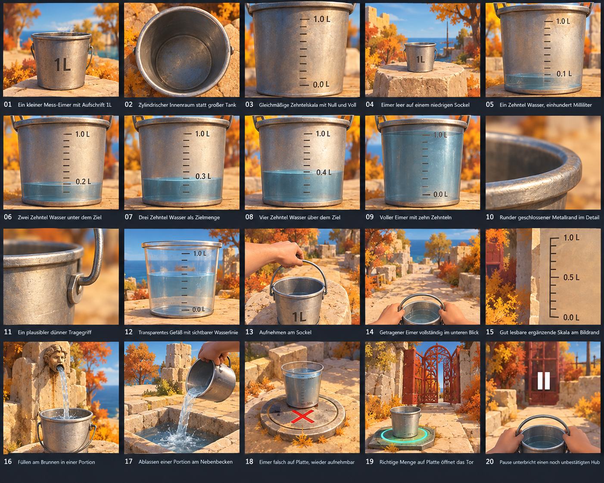
20 präzise Objekt- und Handlungsvorlagen

- **07.01**: Ein kleiner Mess-Eimer mit Aufschrift1L.
- **07.02**: Zylindrischer Innenraum statt großer Tank.
- **07.03**: Gleichmäßige Zehntelskala mit Null und Voll.
- **07.04**: Eimer leer auf einem niedrigen Sockel.
- **07.05**: Ein Zehntel Wasser, einhundert Milliliter.
- **07.06**: Zwei Zehntel Wasser unter dem Ziel.
- **07.07**: Drei Zehntel Wasser als Zielmenge.
- **07.08**: Vier Zehntel Wasser über dem Ziel.
- **07.09**: Voller Eimer mit zehn Zehnteln.
- **07.10**: Runder geschlossener Metallrand im Detail.
- **07.11**: Ein plausibler dünner Tragegriff.
- **07.12**: Transparentes Gefäß mit sichtbarer Wasserlinie.
- **07.13**: Aufnehmen am Sockel.
- **07.14**: Getragener Eimer vollständig im unteren Blick.
- **07.15**: Gut lesbare ergänzende Skala am Bildrand.
- **07.16**: Füllen am Brunnen in einer Portion.
- **07.17**: Ablassen einer Portion am Nebenbecken.
- **07.18**: Eimer falsch auf Platte, wieder aufnehmbar.
- **07.19**: Richtige Menge auf Platte öffnet das Tor.
- **07.20**: Pause unterbricht einen noch unbestätigten Hub.

Übernahme: passende Familien auswählen; nicht jede Ansicht als anderes Modell bauen. Prüfen: Silhouette, Material, Blickfreiheit und dargestellter Zustand. Zahlen, Gategap, Signalanzahl und UI bleiben gesonderte Daten-/Engineprüfungen.

## Tafel 08: Felsfenster
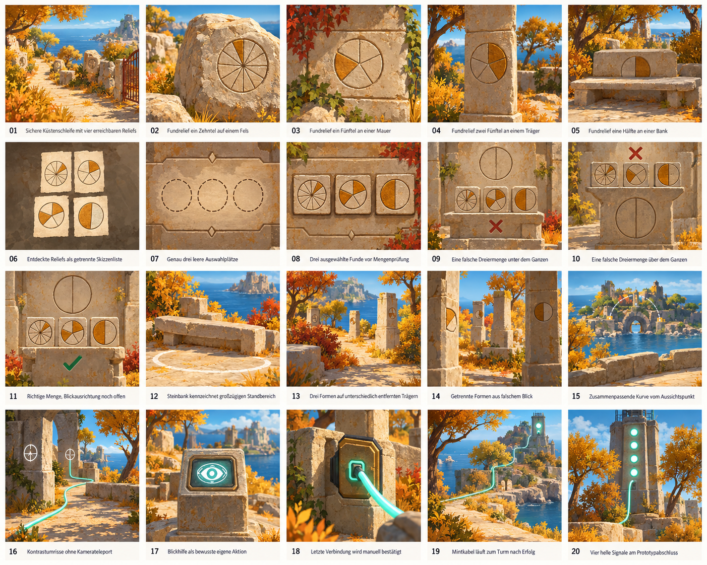
20 Beobachtungs- und Suchstudien

- **08.01**: Sichere Küstenschleife mit vier erreichbaren Reliefs.
- **08.02**: Fundrelief ein Zehntel auf einem Fels.
- **08.03**: Fundrelief ein Fünftel an einer Mauer.
- **08.04**: Fundrelief zwei Fünftel an einem Träger.
- **08.05**: Fundrelief eine Hälfte an einer Bank.
- **08.06**: Entdeckte Reliefs als getrennte Skizzenliste.
- **08.07**: Genau drei leere Auswahlplätze.
- **08.08**: Drei ausgewählte Funde vor Mengenprüfung.
- **08.09**: Eine falsche Dreiermenge unter dem Ganzen.
- **08.10**: Eine falsche Dreiermenge über dem Ganzen.
- **08.11**: Richtige Menge, Blickausrichtung noch offen.
- **08.12**: Steinbank kennzeichnet großzügigen Standbereich.
- **08.13**: Drei Formen auf unterschiedlich entfernten Trägern.
- **08.14**: Getrennte Formen aus falschem Blick.
- **08.15**: Zusammenpassende Kurve vom Aussichtspunkt.
- **08.16**: Kontrastumrisse ohne Kamerateleport.
- **08.17**: Blickhilfe als bewusste eigene Aktion.
- **08.18**: Letzte Verbindung wird manuell bestätigt.
- **08.19**: Mintkabel läuft zum Turm nach Erfolg.
- **08.20**: Vier helle Signale am Prototypabschluss.

Übernahme: passende Familien auswählen; nicht jede Ansicht als anderes Modell bauen. Prüfen: Silhouette, Material, Blickfreiheit und dargestellter Zustand. Zahlen, Gategap, Signalanzahl und UI bleiben gesonderte Daten-/Engineprüfungen.

## Tafel 09: Inselzusammenhang
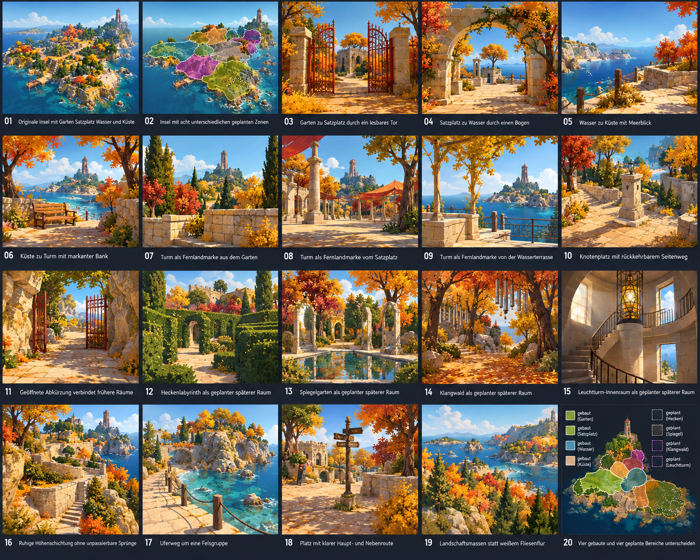
20 Übersichten und Blickbeziehungen

- **09.01**: Originale Insel mit Garten Satzplatz Wasser und Küste.
- **09.02**: Insel mit acht unterschiedlichen geplanten Zonen.
- **09.03**: Garten zu Satzplatz durch ein lesbares Tor.
- **09.04**: Satzplatz zu Wasser durch einen Bogen.
- **09.05**: Wasser zu Küste mit Meerblick.
- **09.06**: Küste zu Turm mit markanter Bank.
- **09.07**: Turm als Fernlandmarke aus dem Garten.
- **09.08**: Turm als Fernlandmarke vom Satzplatz.
- **09.09**: Turm als Fernlandmarke von der Wasserterrasse.
- **09.10**: Knotenplatz mit rückkehrbarem Seitenweg.
- **09.11**: Geöffnete Abkürzung verbindet frühere Räume.
- **09.12**: Heckenlabyrinth als geplanter späterer Raum.
- **09.13**: Spiegelgarten als geplanter späterer Raum.
- **09.14**: Klangwald als geplanter späterer Raum.
- **09.15**: Leuchtturm-Innenraum als geplanter späterer Raum.
- **09.16**: Ruhige Höhenschichtung ohne unpassierbare Sprünge.
- **09.17**: Uferweg um eine Felsgruppe.
- **09.18**: Platz mit klarer Haupt- und Nebenroute.
- **09.19**: Landschaftsmassen statt weißem Fliesenflur.
- **09.20**: Vier gebaute und vier geplante Bereiche unterscheiden.

Übernahme: passende Familien auswählen; nicht jede Ansicht als anderes Modell bauen. Prüfen: Silhouette, Material, Blickfreiheit und dargestellter Zustand. Zahlen, Gategap, Signalanzahl und UI bleiben gesonderte Daten-/Engineprüfungen.

## Tafel 10: Ego-Bedienung
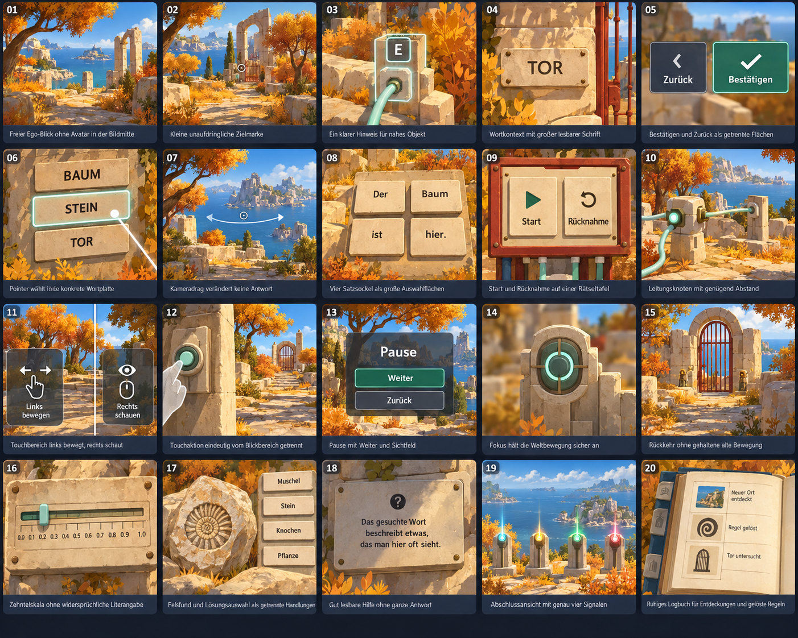
20 Bedien- und Blickstudien

- **10.01**: Freier Ego-Blick ohne Avatar in der Bildmitte.
- **10.02**: Kleine unaufdringliche Zielmarke.
- **10.03**: Ein klarer Hinweis für nahes Objekt.
- **10.04**: Wortkontext mit großer lesbarer Schrift.
- **10.05**: Bestätigen und Zurück als getrennte Flächen.
- **10.06**: Pointer wählt eine konkrete Wortplatte.
- **10.07**: Kameradrag verändert keine Antwort.
- **10.08**: Vier Satzsockel als große Auswahlflächen.
- **10.09**: Start und Rücknahme auf einer Rätseltafel.
- **10.10**: Leitungsknoten mit genügend Abstand.
- **10.11**: Touchbereich links bewegt, rechts schaut.
- **10.12**: Touchaktion eindeutig vom Blickbereich getrennt.
- **10.13**: Pause mit Weiter und Sichtfeld.
- **10.14**: Fokus hält die Weltbewegung sicher an.
- **10.15**: Rückkehr ohne gehaltene alte Bewegung.
- **10.16**: Zehntelskala ohne widersprüchliche Literangabe.
- **10.17**: Felsfund und Lösungsauswahl als getrennte Handlungen.
- **10.18**: Gut lesbare Hilfe ohne ganze Antwort.
- **10.19**: Abschlussansicht mit genau vier Signalen.
- **10.20**: Ruhiges Logbuch für Entdeckungen und gelöste Regeln.

Übernahme: passende Familien auswählen; nicht jede Ansicht als anderes Modell bauen. Prüfen: Silhouette, Material, Blickfreiheit und dargestellter Zustand. Zahlen, Gategap, Signalanzahl und UI bleiben gesonderte Daten-/Engineprüfungen.

## Tafel 11: Fehler und Wiederaufnahme
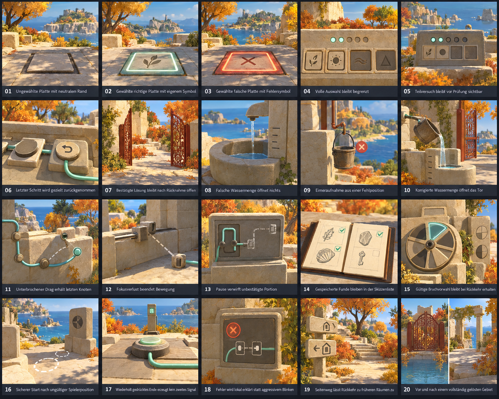
20 Vorher-Nachher-Zustandspaare

- **11.01**: Ungewählte Platte mit neutralem Rand.
- **11.02**: Gewählte richtige Platte mit eigenem Symbol.
- **11.03**: Gewählte falsche Platte mit Fehlersymbol.
- **11.04**: Volle Auswahl bleibt begrenzt.
- **11.05**: Teilversuch bleibt vor Prüfung sichtbar.
- **11.06**: Letzter Schritt wird gezielt zurückgenommen.
- **11.07**: Bestätigte Lösung bleibt nach Rücknahme offen.
- **11.08**: Falsche Wassermenge öffnet nichts.
- **11.09**: Eimeraufnahme aus einer Fehlposition.
- **11.10**: Korrigierte Wassermenge öffnet das Tor.
- **11.11**: Unterbrochener Drag erhält letzten Knoten.
- **11.12**: Fokusverlust beendet Bewegung.
- **11.13**: Pause verwirft unbestätigte Portion.
- **11.14**: Gespeicherte Funde bleiben in der Skizzenliste.
- **11.15**: Gültige Bruchvorwahl bleibt bei Rückkehr erhalten.
- **11.16**: Sicherer Start nach ungültiger Spielerposition.
- **11.17**: Wiederholt gedrücktes Ende erzeugt kein zweites Signal.
- **11.18**: Fehler wird lokal erklärt statt aggressivem Blinken.
- **11.19**: Seitenweg lässt Rückkehr zu früheren Räumen zu.
- **11.20**: Vor und nach einem vollständig gelösten Gebiet.

Übernahme: passende Familien auswählen; nicht jede Ansicht als anderes Modell bauen. Prüfen: Silhouette, Material, Blickfreiheit und dargestellter Zustand. Zahlen, Gategap, Signalanzahl und UI bleiben gesonderte Daten-/Engineprüfungen.

## Tafel 12: Licht und Materialqualität
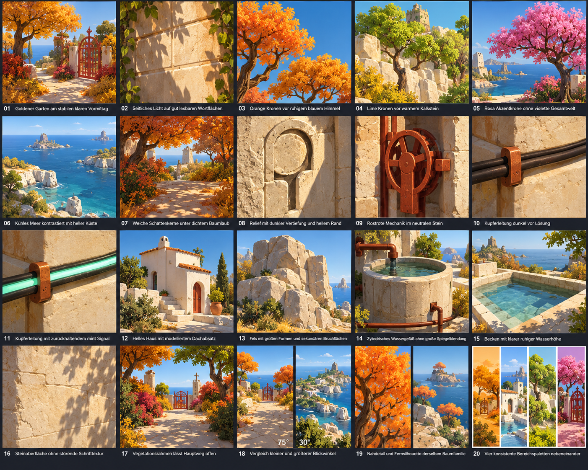
20 Farb-, Schatten- und Detailstudien

- **12.01**: Goldener Garten am stabilen klaren Vormittag.
- **12.02**: Seitliches Licht auf gut lesbaren Wortflächen.
- **12.03**: Orange Kronen vor ruhigem blauem Himmel.
- **12.04**: Lime Kronen vor warmem Kalkstein.
- **12.05**: Rosa Akzentkrone ohne violette Gesamtwelt.
- **12.06**: Kühles Meer kontrastiert mit heller Küste.
- **12.07**: Weiche Schattenkerne unter dichtem Baumlaub.
- **12.08**: Relief mit dunkler Vertiefung und hellem Rand.
- **12.09**: Rostrote Mechanik im neutralen Stein.
- **12.10**: Kupferleitung dunkel vor Lösung.
- **12.11**: Kupferleitung mit zurückhaltendem mint Signal.
- **12.12**: Helles Haus mit modelliertem Dachabsatz.
- **12.13**: Fels mit großen Formen und sekundären Bruchflächen.
- **12.14**: Zylindrisches Wassergefäß ohne große Spiegelblendung.
- **12.15**: Becken mit klarer ruhiger Wasserhöhe.
- **12.16**: Steinoberfläche ohne störende Schrifttextur.
- **12.17**: Vegetationsrahmen lässt Hauptweg offen.
- **12.18**: Vergleich kleiner und größerer Blickwinkel.
- **12.19**: Nahdetail und Fernsilhouette derselben Baumfamilie.
- **12.20**: Vier konsistente Bereichspaletten nebeneinander.

Übernahme: passende Familien auswählen; nicht jede Ansicht als anderes Modell bauen. Prüfen: Silhouette, Material, Blickfreiheit und dargestellter Zustand. Zahlen, Gategap, Signalanzahl und UI bleiben gesonderte Daten-/Engineprüfungen.

